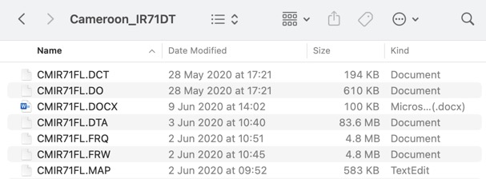
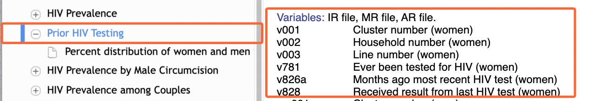

```{r echo =F, warning=F, message=F}
# Load packages 
if(!require(pacman)) install.packages("pacman")
pacman::p_load(tidyverse)
```

# **Summary**

For the final project, you will use Demographic and Health Survey (DHS) data to create a short Rmarkdown-based report, focusing on a specific country and a topic of your choosing.

The report should:

-   Be based on one of the DHS women's recode survey datasets we have compiled for you [here](https://drive.google.com/drive/u/0/folders/1J0gw4qpfbB8bYFbXx8QcsQEWgJSVwp_P){target="_blank"};

-   Be at least 300 words in length; and

-   Include at least four ggplot2-based figures

A typical approach for the report structure is to select a principal variable, then generate plots showing how that variable's distribution changes in relation to other variables. For instance, one could analyze how contraceptive use varies among different segments of the population, or how access to clean water differs across various socio-economic groups. There are hundreds of variables to choose from!

To submit, you should upload a zip folder with two files---your Rmarkdown and your knitted HTML/PDF/DOCX file---to the assignment page.

Those are the instructions in a nutshell! The rest of this document consists of the grading rubric, some recommended analysis steps and a set of optional appendices.

# **Grading Rubric**

As you work on your analysis, you should keep in mind the following rubric against which your work will be graded.

-   **Data wrangling (35%)**

Demonstrate that you have used appropriate data wrangling techniques to prepare the data for analysis. In particular, we recommend that you use at least four of the eight dplyr functions covered in the data wrangling chapter (`select()`, `filter()`, `mutate()`, `case_when()`, `group_by()`, `summarize()`, `pivot_wider()` and `pivot_longer()`)

-   **Quality of figures (35%)**

Create at least four ggplot-based figures that are clear, informative, and aesthetically pleasing. Include appropriate titles and labels for your figures.

-   **Use of Rmarkdown (20%)**

Demonstrate that you can use R Markdown to create a professional document. This entails using appropriate formatting and Rmarkdown features such as inline code.

-   **Syntax and code formatting (10%)**

Use clean, well-organized code that is easy to read and understand. This includes using appropriate indentation, commenting your code, and using clear, descriptive variable names.

# **Analysis step 1: Obtain the women's recode file for a specific country**

DHS data is normally obtained by request from the DHS website [here](https://dhsprogram.com/data/new-user-registration.cfm){target="_blank"}. However, to speed you up, we have already requested and compiled the data you will need: the latest women's recode datasets for most countries surveyed since 2003. **You should select a survey to analyze from this collection. To access these files, follow this Google Drive [link](https://drive.google.com/drive/folders/1J0gw4qpfbB8bYFbXx8QcsQEWgJSVwp_P?usp=share_link){target="_blank"}.** 

Once you have downloaded and unzipped the folder, you will see that it contains several different file types:

{width="500"}

The only two files you need are the .DTA file (which is the main survey data file in STATA format) and the .MAP file (the data dictionary).

Create a new RStudio project for your analysis and place these two files in the "data" subfolder of your project.

# **Analysis step 2: Import your dataset into R**

To import the DHS dataset from the .DTA format into R, you should use the `read_dta()` function from the {haven} package.

Because DHS files are very large, you should not import the entire dataset at once, as this may take very long to run. Instead, you should use either the `n_max` or the `col_select` argument of `read_dta()` to import just a data subset.

The `n_max` argument allows you to specify the number of rows to import. For example:

```{r eval = F}
ir_raw <- haven::read_dta(here("data/NGIR7BFL.DTA"),
                          n_max = 300)
```

This will only import the first 300 rows.

The `col_select` argument allows you to select specific columns to import, either by name or by position. For example:

```{r eval = F}
# select by position
ir_raw <- haven::read_dta(here("data/NGIR7BFL.DTA"),
                          col_select = 1:3)

# select three variables by name
ir_raw <- haven::read_dta(here("data/NGIR7BFL.DTA"),
                           col_select = c(caseid, v000, v001))
```

Another note on importing data: the `read_dta()` function reads in factor data as a special data type called **labelled** data. This type is unfamiliar to you and can be problematic for later analysis, so we recommend converting these to regular R factors using the function `haven::as_factor()`.

For example:

```{r eval = F}
ir_converted <- 
  ir_raw %>%
  haven::as_factor() # pass the data frame to as_factor()
```

# **Analysis step 3: Identify and analyze the relevant variables**

To find variables relevant to your chosen topic, there are a few resources that could be of help:

1.  The first is the .MAP file you downloaded. If you open the .MAP file for your downloaded survey (with TextEdit or Notepad or even RStudio) you'll see that it is a data dictionary with a definition for each variable. Here are a few lines from one such .MAP file:

    CASEID (id) Case Identification\
    V000 Country code and phase\
    V001 Cluster number\
    V002 Household number\
    V003 Respondent's line number

    As you can see, each line has the name of the variable and the variable's definition.

    So, if you are working on a topic like HIV, you can simply search the .MAP file for the word "HIV", and you will be lead to the HIV-relevant variables.

2.  Sometimes the variable descriptions in the .MAP files are not detailed enough. In that case, you can search for specific variables in a DHS recode [manual](https://dhsprogram.com/pubs/pdf/DHSG4/Recode7_DHS_10Sep2018_DHSG4.pdf){target="_blank"}

    The recode manuals are similar to the MAP files, but they explain each variable in more detail.

3.  The DHS has also created an easily-navigable web resource called "Guide to DHS statistics", viewable [here](https://dhsprogram.com/data/Guide-to-DHS-Statistics){target="_blank"}. If you are studying a topic like HIV, you can simply go to HIV section, click on a specific subtopic, e.g. "Prior HIV testing" and you will see a list of variables that are relevant to that statistic.



4.  Finally, looking at official DHS publications on this [page](https://dhsprogram.com/publications/index.cfm){target="_blank"} may also be helpful.

    **Note that the variables covered by the DHS vary from survey to survey, so some trial and error may be required to find an interesting topic that is covered in the dataset you chose.**

# **Final step: Export and submit your work**

Once your work is done, to submit it you should:

-   Knit your Rmd to an HTML/PDF or DOCX format.

-   Upload BOTH your Rmd and one of the export formats to the submission page.


# **Appendix 1: Sample reports**

To help get a sense of what other students in the past have created, you can view past student work [here](https://minhaskamal.github.io/DownGit/#/home?url=https://github.com/the-graph-courses/rbb_cohort_1_materials/tree/main/rbb_final_project/sample_assignments){target="_blank"}

# **Appendix 2: Information about the DHS**

The Demographic and Health Surveys (DHS) are a series of standardized surveys conducted periodically in developing countries that collect data on various aspects of population, health, and nutrition. 

You can learn more about the DHS program and the various surveys they run by watching the following [video](https://www.youtube.com/watch?v=abP6xeb50Do){target="_blank"}. To hear about the different types of data the DHS collects, you can watch the following [video](https://www.youtube.com/watch?v=BmiSDPebmgc){target="_blank"}.

Finally, to see the kind of reports that are created from the DHS surveys, visit this [page](https://dhsprogram.com/publications/index.cfm){target="_blank"}.


# **Appendix 3: Other FAQs**

**My percentages and numbers differ slightly with those seen in the official DHS publications. What is going on?**

Your calculated statistics will differ slightly from the official numbers because these official reports use weighted analysis, which we have not yet taught you. This is okay. For those of you interested, you can find a small example of weighted survey analysis [here](https://github.com/the-graph-courses/rbp_cohort_0_final_assessment/blob/main/scripts/example_of_weighted_survey_analysis.R){target="_blank"}.

**Must the report be in English?**

You are allowed to write the report in English, French or Spanish.

**Can I use data from a different survey than the Demographic and Health Survey (DHS)?**

Yes, but you will first need to obtain permission from one of our instructors.

**Can I create a dashboard using flexdashboard instead of a flat HTML/PDF document?**

Yes. Any Rmarkdown-based format is acceptable!

